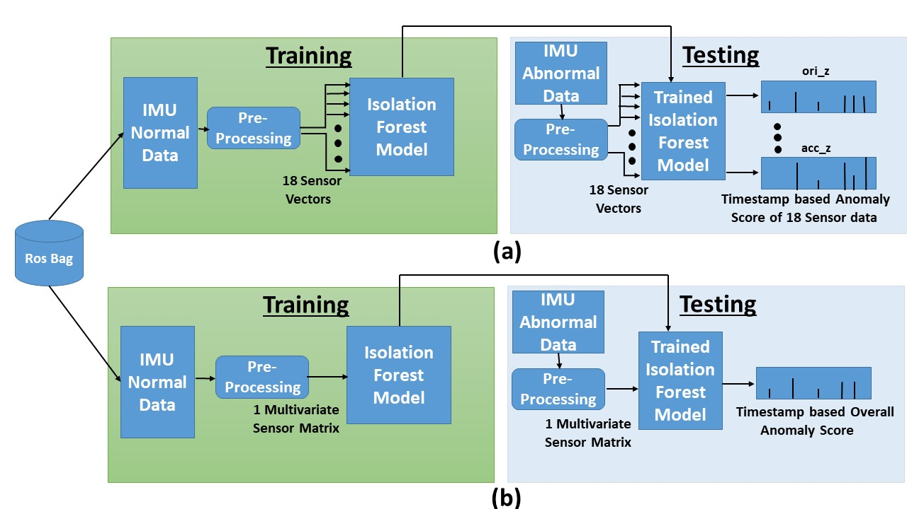
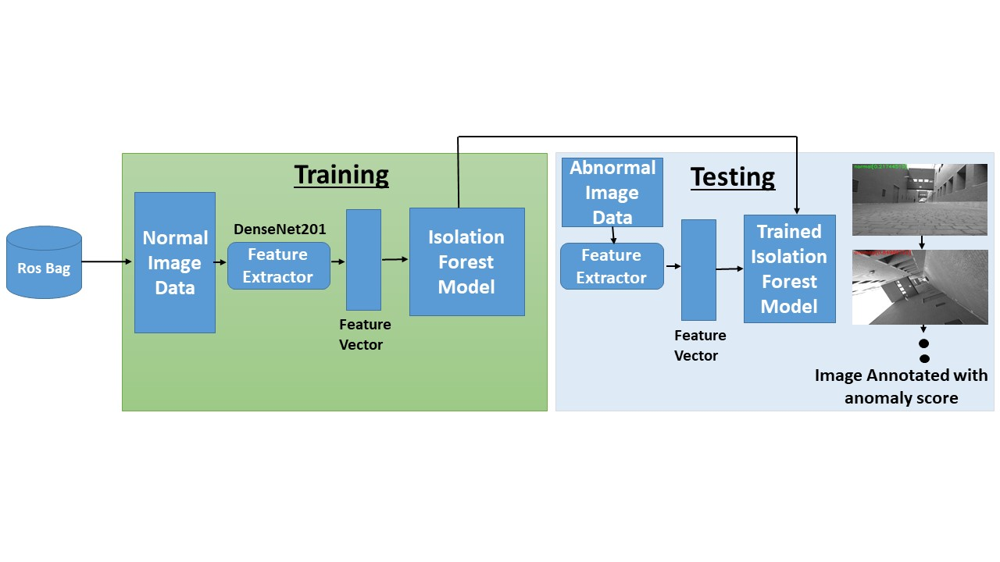
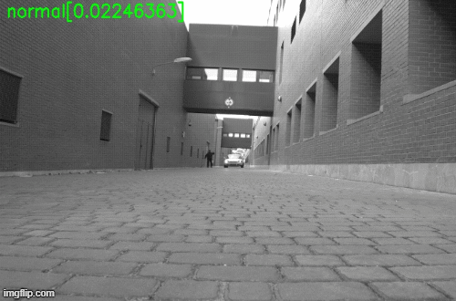
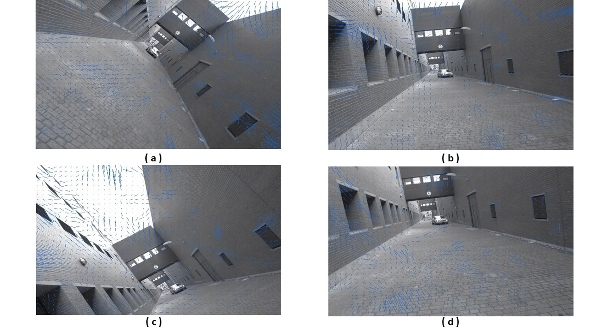

# Anomaly_Detection-by-Isolation-Forest
Unsupervised anomaly detection is now a days very vital thing in digital world.Anomaly always expected to happen rarely so unsupervised approach is necessary to deal with it.Isolation forest is one of the renowned method to detect anomaly unsupervised manner.Various use of isolation forest is showed in the repository.Anomaly detection from a heterogeneous autonomous system is mainly presented here.A multimodal sensorial information(can be sync IMU sensor fusion data with image data) is used to detect anomaly and quantifying it in every timestamp.
Simple illustration of the approach is given below both for image and IMU sensorial data:



Here upper one is the univariate approach to define anomalous feature and lower one is the multivariate approach to detect and quantify anomaly. 


Here it is a simplified diagram of anomaly detection approach from image.A demonstration of anomaly detection from image is shown below:





For further improvement feature extraction from the help of optical flow frame was done.But the result wasn't satisfactory for this dataset as quiver plot show some redundacies.The below image illustrates nicely that quiver plot is not enough to represent the motion that causes anomaly.



## Installation
1. Clone this repository
2. Install dependencies
   ```bash
   pip install keras
   pip install pandas
   pip install sklearn
   pip install scikit-learn==0.21.2
   pip install pickle-mixin
   pip install opencv-contrib-python
   pip install matplotlib
   pip install numpy
   ```

## Getting Started 
* [inference.py](inference.py) is the main inference code to run anomaly detection on csv file of IMU data/desired input data.
N.B: To run this code you need to place the training(normal/mostly normal) data csv in the parent directory to increase normal data distribution space.

* [isofor_test.py](isofor_test.py) It is helper function file to run inference.py.It contains the function of multivariate and univariate isolation forest respectively as ' isolation_forest_score() ' and ' univariate_score() '

* [findsensor.py](findsensor.py) It is also a helper function file to run inference.py.It contains the function of to find the top responsible features that causing anomaly in anomalous sample.

* [isofor_Multivariate_Train.py](isofor_Multivariate_Train.py) is the code to train a model using normal data to show the model normal data representation.

* [isofor_train_anomaly_detector_image.py](isofor_train_anomaly_detector_image.py) is the code to train a model using normal image data to show the model normal data representation to isolation forest model.

* [isofor_test_anomaly_detector_image.py](isofor_test_anomaly_detector_image.py) is the inference code to determine anomaly data from anomalous image.It can generate anomaly score frame by frame.

* [Flow_train.py](Flow_train.py) is the code to train normal frame of quiver plot on raw image. 

* [Flow_test.py](Flow_test.py) is the code to determine anomaly from quiver plot on image(quiver plot on raw image) 

## Documentation
Related paper of Isolation forest 
* [Isolation Forest](https://cs.nju.edu.cn/zhouzh/zhouzh.files/publication/icdm08b.pdf?q=isolation-forest)
* [Isolation forest to detect anomaly in UAV](https://www.researchgate.net/publication/334685626_Unsupervised_anomaly_detection_in_unmanned_aerial_vehicles)


* [Isolation Forest python library documentation](https://scikit-learn.org/stable/modules/generated/sklearn.ensemble.IsolationForest.html)


## Acknowledgement
Base code of anomaly detection from image is borrowed from :https://www.pyimagesearch.com/2020/01/20/intro-to-anomaly-detection-with-opencv-computer-vision-and-scikit-learn/
